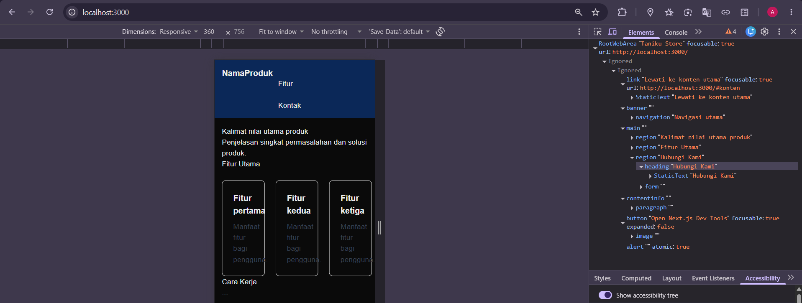
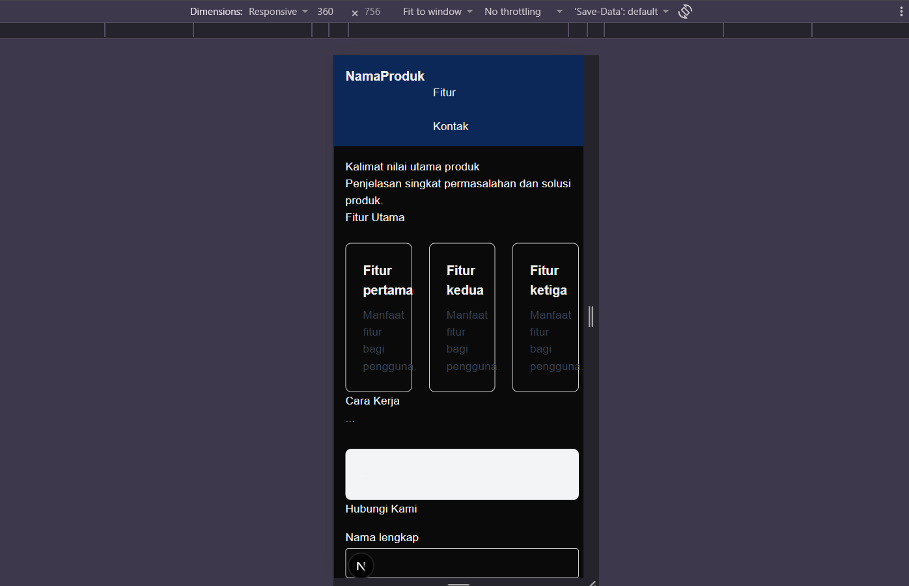
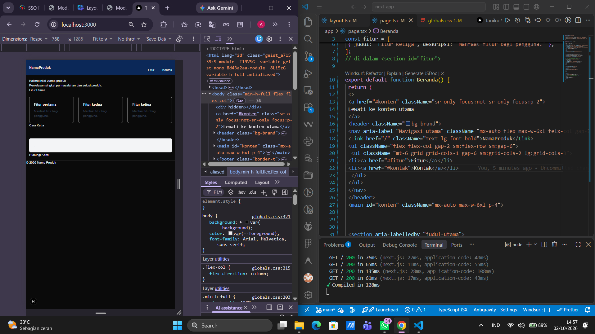
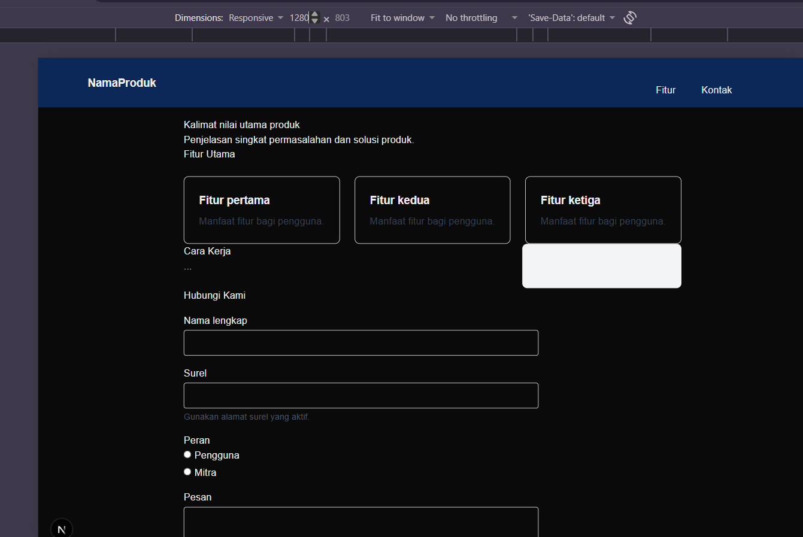
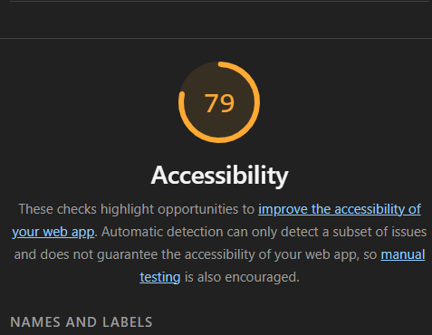
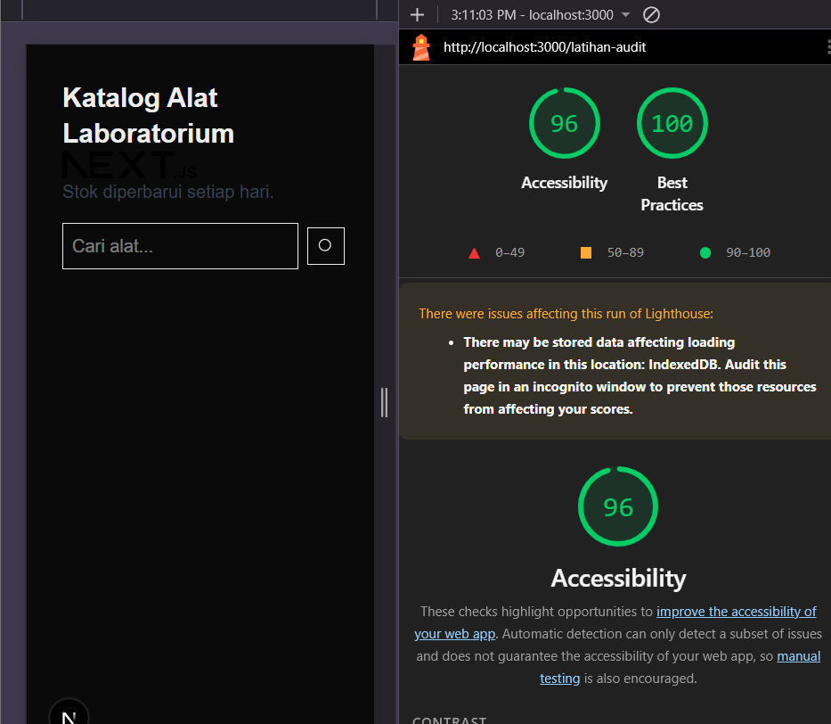
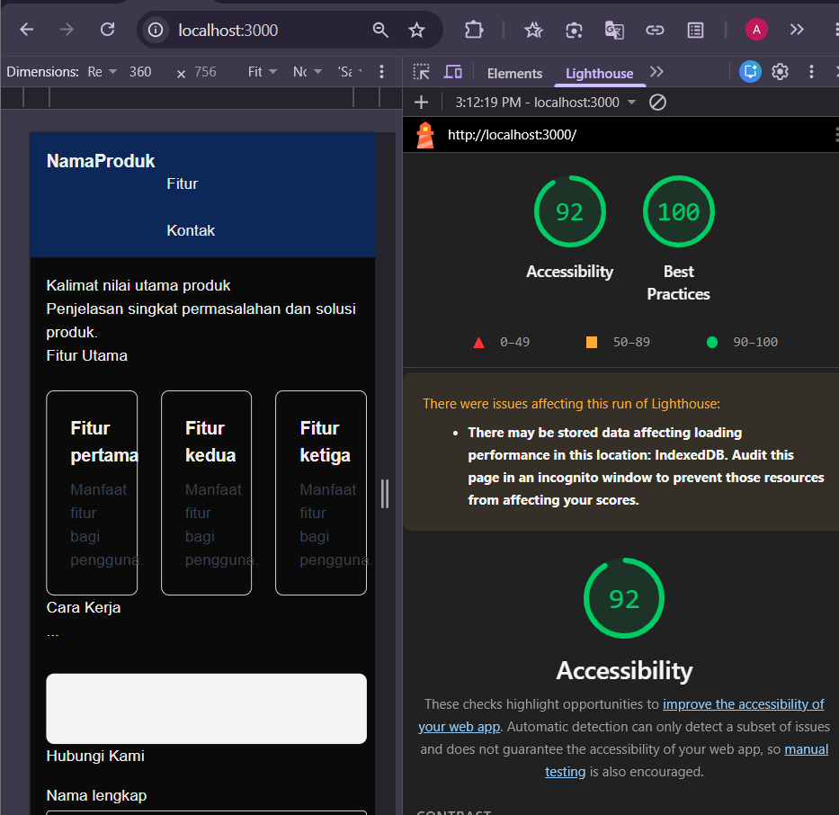

# Dokumen Teknis Modul 2 HTML Semantik, Tailwind CSS, dan Aksesibilitas

**Nama / NIM** : Adrenalin Syahrobby / 105224030
**Repositori** : https://github.com/Sennn306/Modul2_PraktikumPAW

---

## 1. Struktur Semantik

Halaman utama dikembangkan menggunakan elemen semantik HTML5 yang dipetakan secara terprogram ke peran landmark ARIA (seperti `banner`, `navigation`, `main`, `region`, dan `contentinfo`) untuk memastikan aksesibilitas pembaca layar. Hierarki judul disusun secara runtut menggunakan satu `<h1>` untuk kalimat nilai utama produk dan `<h2>` untuk setiap bagian (`section`).

- **Tangkapan Layar Pohon Aksesibilitas (DevTools):**  
  

---

## 2. Tata Letak Responsif

Tata letak halaman dirancang menggunakan pendekatan _mobile-first_ bawaan Tailwind CSS v4, di mana tampilan awal menargetkan layar ponsel, kemudian diperluas menggunakan breakpoint `sm:` (640px) dan `lg:` (1024px).

### Tangkapan Layar Tampilan Responsif:

- **Ukuran Layar 360 px (Mobile):**  
  
- **Ukuran Layar 768 px (Tablet):**  
  
- **Ukuran Layar 1280 px (Desktop):**  
  

### Kelas Flexbox, Grid, dan Breakpoint yang Digunakan:

1. **Navigasi Utama (`<nav>`):**
   - _Kelas:_ `flex flex-col gap-3 sm:flex-row sm:items-center sm:justify-between`
   - _Alasan:_ Menggunakan Flexbox satu dimensi. Pada layar ponsel, item bertumpuk secara vertikal (`flex-col`), lalu pada layar `sm` (≥640px) beralih menjadi mendatar (`flex-row`) dengan rata kiri-kanan (`justify-between`) agar ruang navigasi optimal.
2. **Kartu Fitur (`<ul>`):**
   - _Kelas:_ `grid grid-cols-1 gap-6 sm:grid-cols-2 lg:grid-cols-3`
   - _Alasan:_ Menggunakan Grid dua dimensi untuk menata kartu fitur secara rapi. Tampilan ponsel menggunakan 1 kolom, layar `sm` (≥640px) menggunakan 2 kolom, dan layar `lg` (≥1024px) menggunakan 3 kolom.
3. **Konten Utama & Sidebar (`
`):**
   - _Kelas:_ `grid gap-8 lg:grid-cols-[2fr_1fr]`
   - _Alasan:_ Konten utama dan `<aside>` bertumpuk di ponsel/tablet, lalu pada layar `lg` (≥1024px) tampil berdampingan dengan rasio 2:1 menggunakan _arbitrary value_ Grid (`2fr 1fr`).

---

## 3. Audit Aksesibilitas

### Tabel Skor Lighthouse:

| **Halaman Latihan (`/latihan-audit`)** |

| **Halaman Utama Produk** |

### Daftar Audit yang Gagal, Penyebab, dan Perbaikannya:

1. **Image elements do not have [alt] attributes**
   - _Penyebab:_ Elemen `` tidak memiliki atribut teks alternatif `alt`.
   - _Perbaikan:_ Menambahkan atribut `alt="Logo Next.js"` yang deskriptif.
2. **Background and foreground colors do not have a sufficient contrast ratio**
   - _Penyebab:_ Teks menggunakan kelas `text-gray-300` di atas latar terang, sehingga rasio kontras < 4,5:1.
   - _Perbaikan:_ Mengganti kelas menjadi `text-gray-700` untuk meningkatkan rasio kontras warna.
3. **Form elements do not have associated labels**
   - _Penyebab:_ Elemen `<input type="search">` tidak terhubung dengan elemen `<label>`.
   - _Perbaikan:_ Menambahkan `<label htmlFor="search">` yang terhubung secara eksplisit dengan `id="search"`.
4. **Buttons do not have an accessible name**
   - _Penyebab:_ Tombol hanya memuat ikon SVG tanpa teks terbacakan oleh _screen reader_.
   - _Perbaikan:_ Menambahkan atribut `aria-label="Cari"` pada `<button>` dan `aria-hidden="true"` pada ikon SVG.

### Hasil Pemeriksaan Manual dengan Papan Ketik:

- **Urutan Fokus (Tab Index):** Navigasi berurutan secara logis dari tautan _"Lewati ke konten utama"_, logo, menu navigasi, tombol/formulir di konten utama, hingga tautan pada _footer_.
- **Garis Fokus (_Focus Visible_):** Seluruh elemen interaktif dan kolom isian formulir memiliki indikator fokus yang jelas dan kontras saat ditekan tombol `Tab`, menggunakan kelas `focus-visible:outline-2 focus-visible:outline-offset-2 focus-visible:outline-blue-700`.

---

## 4. Kendala dan Penyelesaian

- **Kendala:** Muncul gulir horizontal (_horizontal scroll_) pada pengujian ukuran layar 360 px.  
  **Penyelesaian:** Ditemukan penggunaan lebar tetap pada salah satu elemen. Diperbaiki dengan mengganti lebar tetap menjadi `w-full` dan menambahkan pembatas lebar maks `max-w-6xl` serta penyesuaian breakpoint responsif.
- **Kendala:** Penggunaan kelas Tailwind CSS kustom tidak memunculkan gaya visual.  
  **Penyelesaian:** Memastikan penambahan variabel tema warna pada blok `@theme` di `app/globals.css` sesuai spesifikasi Tailwind CSS v4.

---

## 5. Catatan Pemanfaatan AI

- **Alat:** Gemini
- **Perintah Utama (Prompt):** "Buat struktur dari dokumen teknis berupa file dengan format .md"
- **Bagian yang Digunakan:** Penyusunan struktur ringkasan dokumen teknis `docs/praktikum/modul-02.md`
- **Cara Verifikasi:** Memeriksa kembali kelengkapan seluruh kriteria rubrik penilaian modul 2, memastikan seluruh poin sesuai dengan pekerjaan praktikum yang telah dilakukan, serta menjalankan audit ulang Lighthouse secara mandiri di peramban.
